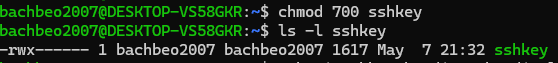

# Bandit 0

The goal of this level is for you to log into the game using SSH. The host to which you need to connect is bandit.labs.overthewire.org, on port 2220

The password for the next level is stored in a file called readme located in the home directory.

**ls** - list files

**cat** - show the content of a file

This is my result

ZjLjTmM6FvvyRnrb2rfNWOZOTa6ip5If

# Bandit 1

The password for the next level is stored in a file called - located in the home directory

You can not directly cat "-" so you must add "./" before it

263JGJPfgU6LtdEvgfWU1XP5yac29mFx

# Bandit 2

The password for the next level is stored in a file called **"spaces in this filename"** located in the home directory

The filename has spaces so you must put it in the **" "**.

MNk8KNH3Usiio41PRUEoDFPqfxLPlSmx

# Bandit 3

The password for the next level is stored in a hidden file in the inhere directory.

It is a hidden file so you should use **"ls -la"** to show it. 

2WmrDFRmJIq3IPxneAaMGhap0pFhF3NJ

# Bandit 4

The password for the next level is stored in the only human-readable file in the inhere directory

Use **"file ./*"** to show the type of all files and the only human-readable file is **"-file07"**, which is ASCII text. 

4oQYVPkxZOOEOO5pTW81FB8j8lxXGUQw

# Bandit 5

The password for the next level is stored in a file somewhere under the inhere directory and has all of the following properties:

human-readable

1033 bytes in size

not executable

use **"find"**:

**-type f** - check only files

**-size 1033c** - size 1033 bytes

**! -executable** - excluding files that can be run

HWasnPhtq9AVKe0dmk45nxy20cvUa6EG

# Bandit 6

The password for the next level is stored somewhere on the server and has all of the following properties:

owned by user bandit7
owned by group bandit6
33 bytes in size

**-user** - owned by user

**-group** - owned by group

**2</dev/null** - hides any "permission denied" error 

morbNTDkSW6jIlUc0ymOdMaLnOlFVAaj

# Bandit 7

The password for the next level is stored in the file data.txt next to the word millionth

**grep** - search for specific patterns or text within files 

dfwvzFQi4mU0wfNbFOe9RoWskMLg7eEc

# Bandit 8

The password for the next level is stored in the file data.txt and is the only line of text that occurs only once

**sort** - sort lines in the file

**uniq** - remove or filter duplicate lines

4CKMh1JI91bUIZZPXDqGanal4xvAg0JM

# Bandit 9

The password for the next level is stored in the file data.txt in one of the few human-readable strings, preceded by several ‘=’ characters.

**strings** - extract human-readable strings from the file

FGUW5ilLVJrxX9kMYMmlN4MgbpfMiqey

# Bandit 10

The password for the next level is stored in the file data.txt, which contains base64 encoded data

**base64** - decode or encode base64 strings

dtR173fZKb0RRsDFSGsg2RWnpNVj3qRr

# Bandit 11

The password for the next level is stored in the file data.txt, where all lowercase (a-z) and uppercase (A-Z) letters have been rotated by 13 positions

**tr** - replace,delete,or squeeze characters from input

7x16WNeHIi5YkIhWsfFIqoognUTyj9Q4

# Bandit 12

The password for the next level is stored in the file data.txt, which is a hexdump of a file that has been repeatedly compressed. For this level it may be useful to create a directory under /tmp in which you can work. Use mkdir with a hard to guess directory name. Or better, use the command “mktemp -d”. Then copy the datafile using cp, and rename it using mv (read the manpages!)

**mktemp -d** - create a temporary directory

**cp source.txt destination.txt** - copy source.txt to destination.txt

**mv a.txt b.txt** - move a.txt to b.txt and if they are within the same directory, b.txt replaces a.txt

**xxd a.txt b.txt** - create hexdump file of a.txt in b.txt

**xxd -r a.txt b.txt** - convert it back into binary in b.txt

**gunzip a.gz** - decompress "a.gz" file in "a" and remove "a.gz" 

**bunzip2 a.bz2** - decompress "a.bz2" file in "a" and remove "a.bz2" 

**mkdir temp** - create a folder name "temp"

**tar -xf a -C temp** - extract content from archive "a" into "temp" directory

**mv temp/* a** - move all content in "temp" directory to "a"

**rmdir temp** - erase folder "temp" when it is empty

FO5dwFsc0cbaIiH0h8J2eUks2vdTDwAn

# Bandit 13

The password for the next level is stored in /etc/bandit_pass/bandit14 and can only be read by user bandit14. For this level, you don’t get the next password, but you get a private SSH key that can be used to log into the next level. Note: localhost is a hostname that refers to the machine you are working on

Then you copy the sshkey to another file in your computer

You can use **nano sshkey** and copy the content in it

After I ssh using the private key, it said that the permissions are too open so you should use **chmod** to change the permissions.

# Bandit 14

Bandit 13 stated that the password is stored in **etc/bandit_pass/bandit14**.

The password for the next level can be retrieved by submitting the password of the current level to port 30000 on localhost.

**nc** - or netcat is a command that allows to read and write data over a network connection.

8xCjnmgoKbGLhHFAZlGE5Tmu4M2tKJQo

# Bandit 15

The password for the next level can be retrieved by submitting the password of the current level to port 30001 on localhost using SSL/TLS encryption.

**openssl** - library for secure connection over networks

**openssl s_client** - simple client that connects to a server using SSL/LTS

kSkvUpMQ7lBYyCM4GBPvCvT1BfWRy0Dx

# Bandit 16

The credentials for the next level can be retrieved by submitting the password of the current level to a port on localhost in the range 31000 to 32000. First find out which of these ports have a server listening on them. Then find out which of those speak SSL/TLS and which don’t. There is only 1 server that will give the next credentials, the others will simply send back to you whatever you send to it.

**nmap** 

- -sV flag to do a service/version detection scan 

- -p flag to choose which ports to scan

Only port 31518 and port 31790 have ssl service but port 31518 runs only the echo service so port 31790 is a promising port. 

If it returns "KEYUPDATE", you can add **-quiet** to suppress non-essential output

Finally, it gives you a sshkey to login bandit 17.

# Bandit 17

There are 2 files in the homedirectory: passwords.old and passwords.new. The password for the next level is in passwords.new and is the only line that has been changed between passwords.old and passwords.new

**diff** - compare two files and return the different lines

So you see that the password is x2gLTTjFwMOhQ8oWNbMN362QKxfRqGlO

# Bandit 18

The password for the next level is stored in a file readme in the homedirectory. Unfortunately, someone has modified .bashrc to log you out when you log in with SSH.

If you just ssh in the normal way, it returns "Bye Bye!" 

But ssh not just allows us to log into a machine, it also allows remote execution of commands. 

cGWpMaKXVwDUNgPAVJbWYuGHVn9zl3j8

# Bandit 19

To gain access to the next level, you should use the setuid binary in the homedirectory. Execute it without arguments to find out how to use it. The password for this level can be found in the usual place (/etc/bandit_pass), after you have used the setuid binary.

The owner of setuid binary is bandit20. "-rwsr-x---" means bandit19 can execute the binary,but the binary is executed as user bandit20. 

Executing the binary means running another command as bandit20 so that we can access the password of bandit20. 

0qXahG8ZjOVMN9Ghs7iOWsCfZyXOUbYO

# Bandit 20

There is a setuid binary in the homedirectory that does the following: it makes a connection to localhost on the port you specify as a commandline argument. It then reads a line of text from the connection and compares it to the password in the previous level (bandit20). If the password is correct, it will transmit the password for the next level (bandit21).

We use **echo** to pipe it into netcat. The **-n** flag is to prevent newline characters. 

**nc -l** to tell netcat to wait for a client to connect

EeoULMCra2q0dSkYj561DX7s1CpBuOBt

# Bandit 21

A program is running automatically at regular intervals from cron, the time-based job scheduler. Look in /etc/cron.d/ for the configuration and see what command is being executed.

First, we look at what is in the /etc/cron.d/ and we see the cronjob_bandit22.

This cronjob runs /usr/bin/cronjob_bandit22.sh file as bandit22 user. 

In the bash file, the file creates a file in tmp and gives read permission to everyone(last 4). Then it copies the input of bandit22 password file into the new file. 

tRae0UfB9v0UzbCdn9cY0gQnds9GF58Q

# Bandit 22

We do the same as previous level. 

The script will be run as bandit23 so myname = 'bandit23'

Then it takes the string 'I am user bandit23' and computes its MD5 hash to 'mytarget'.

The final line is the same as previous level so just 'cat' it.

0Zf11ioIjMVN551jX3CmStKLYqjk54Ga

# Bandit 23

