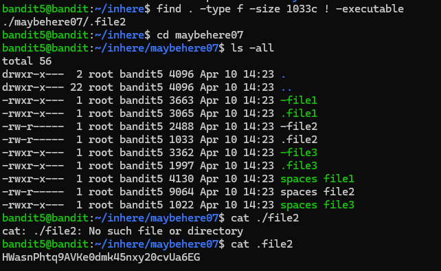
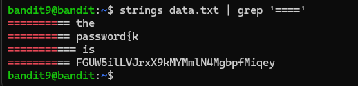

# Bandit 0

The goal of this level is for you to log into the game using SSH. The host to which you need to connect is bandit.labs.overthewire.org, on port 2220

The password for the next level is stored in a file called readme located in the home directory.

This is my result

ZjLjTmM6FvvyRnrb2rfNWOZOTa6ip5If

# Bandit 1

The password for the next level is stored in a file called - located in the home directory

You can not directly cat "-" so you must add "./" before it

263JGJPfgU6LtdEvgfWU1XP5yac29mFx

# Bandit 2

The password for the next level is stored in a file called **"spaces in this filename"** located in the home directory

The filename has spaces so you must put it in the **" "**.

MNk8KNH3Usiio41PRUEoDFPqfxLPlSmx

# Bandit 3

The password for the next level is stored in a hidden file in the inhere directory.

It is a hidden file so you should use **"ls -la"** to show it. 

2WmrDFRmJIq3IPxneAaMGhap0pFhF3NJ

# Bandit 4

The password for the next level is stored in the only human-readable file in the inhere directory

Use **"file ./*"** to show the type of all files and the only human-readable file is **"-file07"**, which is ASCII text. 

4oQYVPkxZOOEOO5pTW81FB8j8lxXGUQw

# Bandit 5

The password for the next level is stored in a file somewhere under the inhere directory and has all of the following properties:

human-readable

1033 bytes in size

not executable

use **"find"**:

**-type f** - check only files

**-size 1033c** - size 1033 bytes

**! -executable** - excluding files that can be run

HWasnPhtq9AVKe0dmk45nxy20cvUa6EG

# Bandit 6

The password for the next level is stored somewhere on the server and has all of the following properties:

owned by user bandit7
owned by group bandit6
33 bytes in size

**-user** - owned by user

**-group** - owned by group

**2</dev/null** - hides any "permission denied" error 

morbNTDkSW6jIlUc0ymOdMaLnOlFVAaj

# Bandit 7

The password for the next level is stored in the file data.txt next to the word millionth

**grep** - search for specific patterns or text within files 

dfwvzFQi4mU0wfNbFOe9RoWskMLg7eEc

# Bandit 8

The password for the next level is stored in the file data.txt and is the only line of text that occurs only once

**sort** - sort lines in the file

**uniq** - remove or filter duplicate lines

4CKMh1JI91bUIZZPXDqGanal4xvAg0JM

# Bandit 9

The password for the next level is stored in the file data.txt in one of the few human-readable strings, preceded by several ‘=’ characters.

**strings** - extract human-readable strings from the file

FGUW5ilLVJrxX9kMYMmlN4MgbpfMiqey

# Bandit 10

The password for the next level is stored in the file data.txt, which contains base64 encoded data

**base64** - decode or encode base64 strings

dtR173fZKb0RRsDFSGsg2RWnpNVj3qRr

# Bandit 11

The password for the next level is stored in the file data.txt, where all lowercase (a-z) and uppercase (A-Z) letters have been rotated by 13 positions

**tr** - replace,delete,or squeeze characters from input

7x16WNeHIi5YkIhWsfFIqoognUTyj9Q4

# Bandit 12

The password for the next level is stored in the file data.txt, which is a hexdump of a file that has been repeatedly compressed. For this level it may be useful to create a directory under /tmp in which you can work. Use mkdir with a hard to guess directory name. Or better, use the command “mktemp -d”. Then copy the datafile using cp, and rename it using mv (read the manpages!)
